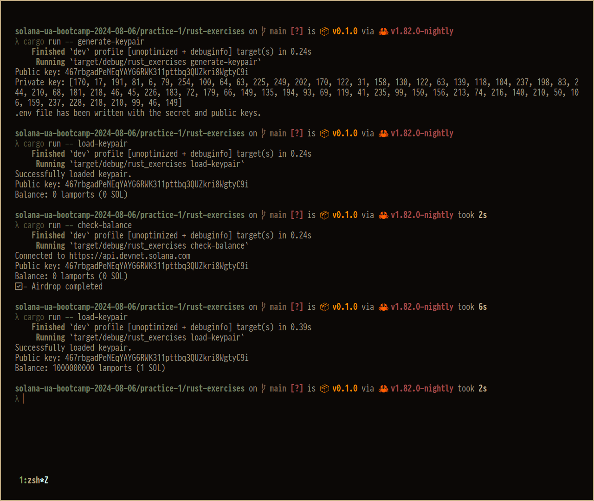

# Usage

```shell
A simple CLI for Solana development

Usage: rust_exercises <COMMAND>

Commands:
  generate-keypair  Generate a new keypair
  load-keypair      Load keypair from .env file
  check-balance     Check balance and optionally airdrop funds
  help              Print this message or the help of the given subcommand(s)

Options:
  -h, --help     Print help
  -V, --version  Print version
```

# Example of work

