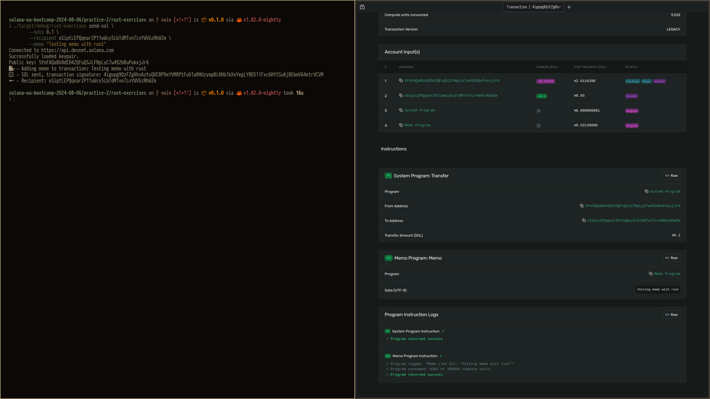
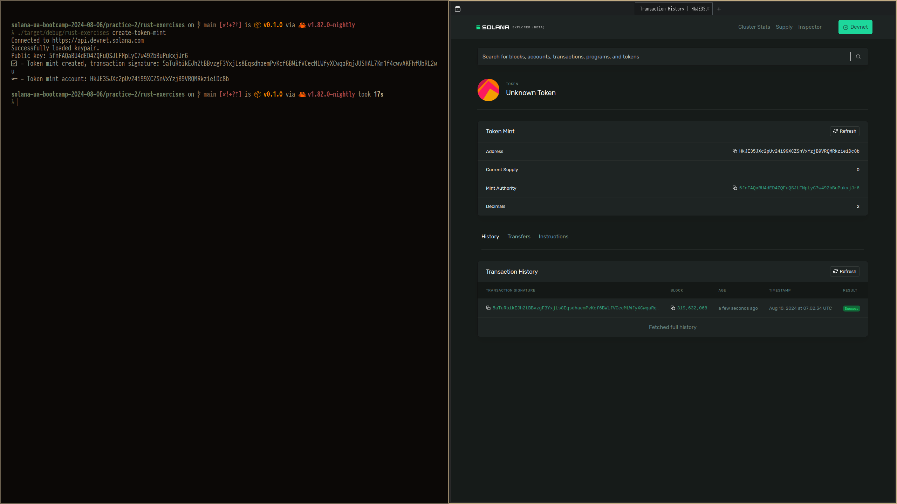
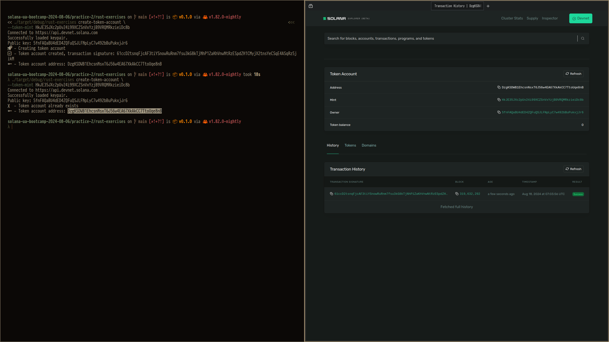
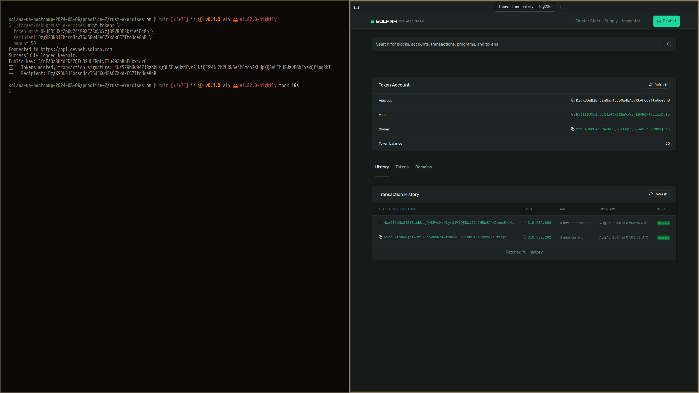
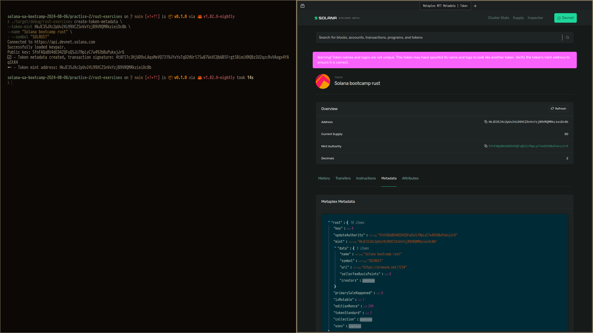

# Usage

```shell
Usage: rust-exercises <COMMAND>

Commands:
  send-sol
  create-token-mint
  create-token-account
  mint-tokens
  create-token-metadata
  help                   Print this message or the help of the given subcommand(s)

Options:
  -h, --help     Print help
  -V, --version  Print version
```

# Example of work

## Send-sol



## Create-token-mint



## Create-token-account



## Mint-tokens



## Create-token-metadata




