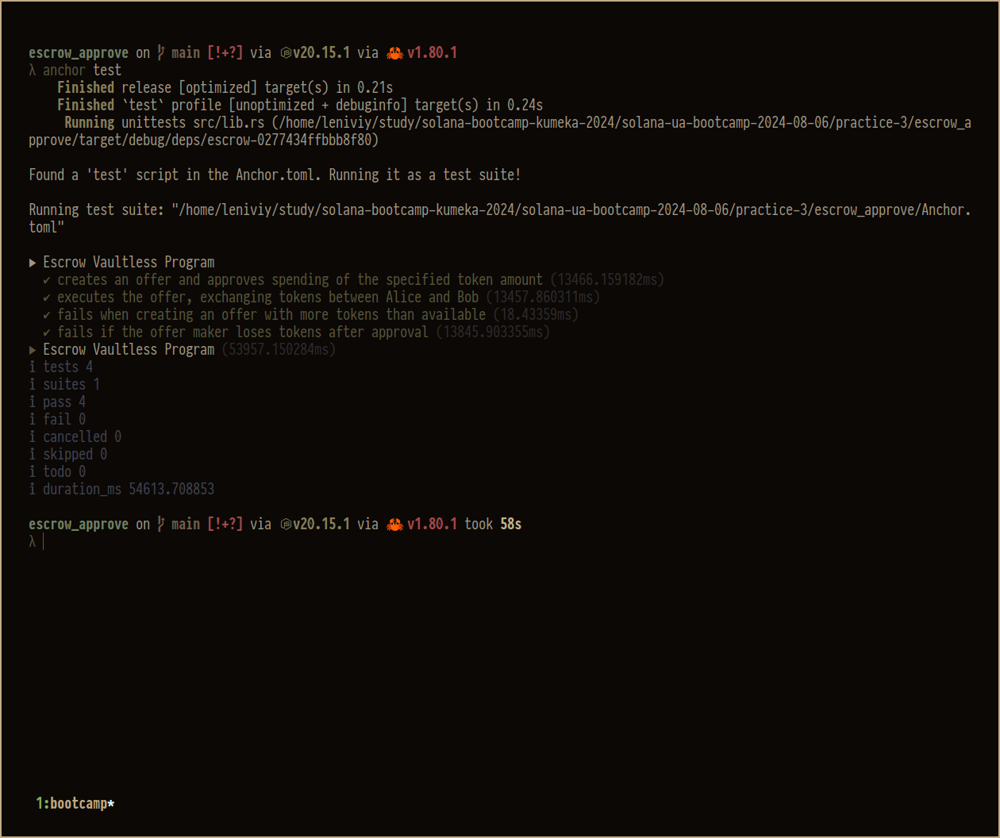

# Vaultless escrow

Simple implementation of escrow, where the offer between maker and taker doesn't mean holding tokens in an intermediate vault. Instead, the maker just approves spending of tokens to the escrow contract.

## Tests running example

